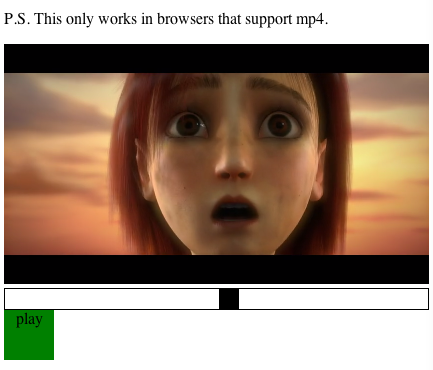
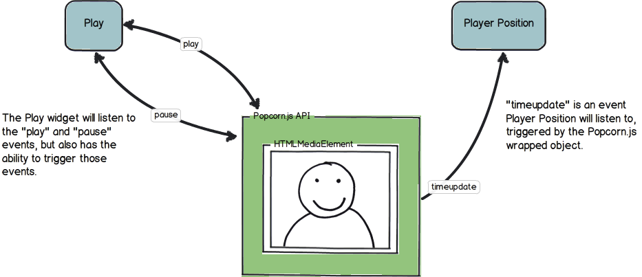
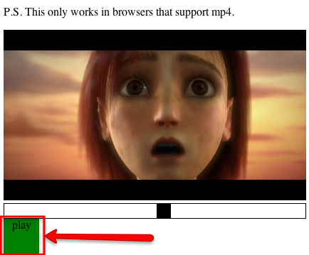
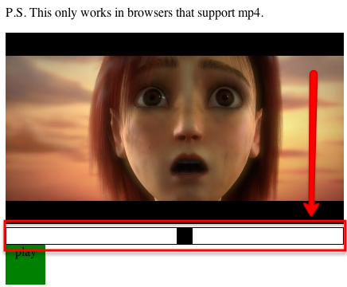

@page playermx PlayerMX
@parent examples 1

This article walks through a simple video player application utilizing Popcorn.js. We'll cover:

 - Installing and running the Application
 - Templated Events with $.Controller//TODO: link this subpage in docs
 - How PlayerMX is built

## Installing and Running the Application

There's two options to install PlayerMX: getjs or using git.

### Download with getjs

//TODO: link to jmvc install docs & root folder article
After downloading and installing JMVC, run the following command:

`./js steal/getjs https://github.com/jupiterjs/playermx/player`

### Git with Github

From a directory of your choice:

_Clone files to your local drive_  
`$ git clone https://github.com/jupiterjs/playermx.git`  

_Navigate to application directory and initialize submodules_  
`$ cd playermx  
$ git submodule update  --init`

### Running

Open player/player.html in your browser and see the application run:

_Note: Safari and Chrome currently support the mp4 codec, however Firefox requires the h.264 Flash player to process mp4's._

You can see our version running here: [http://javascriptmvc.com/player/player.html](http://javascriptmvc.com/player/player.html)

Repo: [https://github.com/jupiterjs/playermx](https://github.com/jupiterjs/playermx)

## PopcornJS Overview

Repo: [https://github.com/jbuck/popcorn-js](https://github.com/jbuck/popcorn-js)

> Popcorn.js is an event framework for HTML5 media. Popcorn.js utilizes the native HTMLMediaElement properties, methods and events, normalizes them into an easy to learn API and provides a plugin system for community contributed interactions.  

_[Source: http://popcornjs.org/documentation](http://popcornjs.org/documentation)_

http://popcornjs.org/api

Popcorn.js wraps up our mp4 into a `video` object which we can pass to our widgets. Our widgets can then play and pause the video based on user interaction. The Popcorn.js API we'll be using is as follows:

* Events:

	* play
	* pause
	* timeupdate

* Properties:

	* paused

* Methods:

	* play()
	* pause()
	* currentTime()
	* duration()

## Templated Events Overview

Templated events create a simple way to bind events without concern for cleanup. For example, binding an event to a DOM element with $.bind(), will be removed when you call $.remove() on that element. However, if you want to listen to events on a model, templated events handle the unbinding for you. In essence, memory concerns are reduced with templated events.

Specifically with `PlayerMX`, our widgets listen to events produced by our Popcorn video element. If that element is removed from our page, by using templated events, we don't need to worry about cleaning up bound methods.

## PlayerMX Architecture

Once you've downloaded the application, you'll notice 3 folders within your `playermx` directory. A few notes on the directory structure of this application:

* The `jquery` folder refers to [jquerymx](https://github.com/jupiterjs/jquerymx). This is the JMVC core and what we'll be building our application on.
* The ['steal'](https://github.com/jupiterjs/steal) folder is our dependency management system. This is how we include other resources such as scripts, stylesheets, templates or other JMVC resources and apps altogether.
* The `player` folder is where we'll place our focus as this is the main directory for our application.  

The application is broken up into one main application page, `player.html`, with a corresponding script, `player.js` and two corresponding widgets.

### player.js

`Player.js` is our main application script. `Steal` allows us to define and load your dependencies. Load the widgets you want to use and initialize them from this file. This loosely couples our widgets from our application. The variable `video` is our reference to the Popcorn.js wrapped object. `play` and `player_position` accept this object as a parameter, which is also labeled `video`.

    steal('./play.js',
      './position.js',

      function() {
        var video = Popcorn("#trailer");

        $('#play').play({ video: video });
        $('#position').player_position({ video: video });
    });

The first line of `player.js` is our call to `steal`. This is going to load all our dependencies. In this case, we load `play.js` and `position.js`, then execute a function.  

### play.js

    steal('player/popcorn',
      'jquery/controller',

      function() {

The purpose of this widget is to control the video playback. Listening to the `play` and `pause` events on the Popcorn.js object, we'll add a CSS class designating playback state.

Our widget will be created using [$.Controller](http://javascriptmvc.com/docs.html#&who=jQuery.Controller). By naming our controller "play", we have now have a jQuery.fn.play() method. `init` is the constructor method for our controller. Any passed parameters are accessible via `options` on the controller.

        $.Controller('Play', {
          init : function(){
            if( this.options.video.video.paused ) {
              this.element.text("play")
            } else {
              this.element.text("stop")
            }
          },

Within player.js, we've passed a video object to our controller. Using templated events, we can listen to the events directly on this object. In the below code, "{video}" refers to our object and "play" is the event we'll listen for.

          "{video} play" : function() {
            this.element.text("stop").addClass('stop')
          },

          "{video} pause" : function() {
            this.element.text("play").removeClass('stop')
          },

Templated events allow listening to events on any object, not just DOM events. In this case, we'll listen to any clicks within 'Play' and in turn toggle the play/pause events respectively. The separation of the click handler and the play/pause handlers is for extensibility. We may have multiple widgets that control the playback of our video and each widget should be able to respond accordingly.

          click : function() {
            if( this.options.video.video.paused ) {
              this.options.video.play()
            } else {
              this.options.video.pause()
            }
          }
      });
    });

### position.js

    steal('player/popcorn',
      'jquery/controller',
      'jquery/dom/dimensions',
      'jquery/event/resize',
      'jquery/event/drag/limit',

Similar to the creation of our 'Play' widget, let's make a widget to show a progression bar for our video. This should not only display playback position, but be draggable as well. `this` in the following context, refers to our widget instance. Our progress indicator will be accessible via the `moving` property. A simple div will suffice for this example and we'll set some basic css properties such as position and dimensions.

      function() {
        $.Controller('PlayerPosition', {
          init : function(){
            this.moving = $("
").css({
              position: 'absolute',
              left: "0px"
            })

            this.element.css("position","relative")
              .append(this.moving);

            this.moving.outerWidth( this.element.height() );
            this.moving.outerHeight( this.element.height() );

          },

Listen to the Popcorn.js `timeupdate` event on our video model to recalculate our indicator position. We've separated the event listener from the resize method to allow for any other widgets that may be listening to `timeupdate`.

          "{video} timeupdate" : function(video){
            this.resize()
          },
          resize : function(){
            var video = this.options.video,
              percent = video.currentTime() / video.duration(),
              width = this.element.width() - this.moving.outerWidth();

            this.moving.css("left", percent*width+"px")
          },

_Note: [draginit]() and 'dragend' are just a couple of events provided by the JMVC framework. [http://edge.javascriptmvc.com/jmvc/docs.html#!jQuery.Drag](http://edge.javascriptmvc.com/jmvc/docs.html#!jQuery.Drag)_  

We won't listen globally for our drag events, but rather scope them to our indicator div element. We can now call the Popcorn.js `play` and `pause` methods, trusting other widgets to respond as needed. In this app, these events will get picked up by our 'Play' widget to start/stop the playback.

          "div draginit" : function(el, ev, drag){
            this.options.video.pause()
            drag.limit(this.element)
          },
          "div dragend" : function(el, ev, drag){
            var video = this.options.video,
              width = this.element.width() - this.moving.outerWidth()
              percent = parseInt(this.moving.css("left"), 10) / width;

            video.currentTime(  percent * video.duration()  );
            video.play()
          }
        });
    });

## Conclusion

'The secret to building large applications is to never build large applications.' - Justin Meyer  

Applications can quickly become overwhelming, complex and difficult to maintain. The takeaway from the PlayerMX architecture is to create isolated, dumb widgets that can be tied together with events. This article is only an example of how to loosely couple your widgets, use templated events and integrate with a pre-existing API(Popcorn.js).